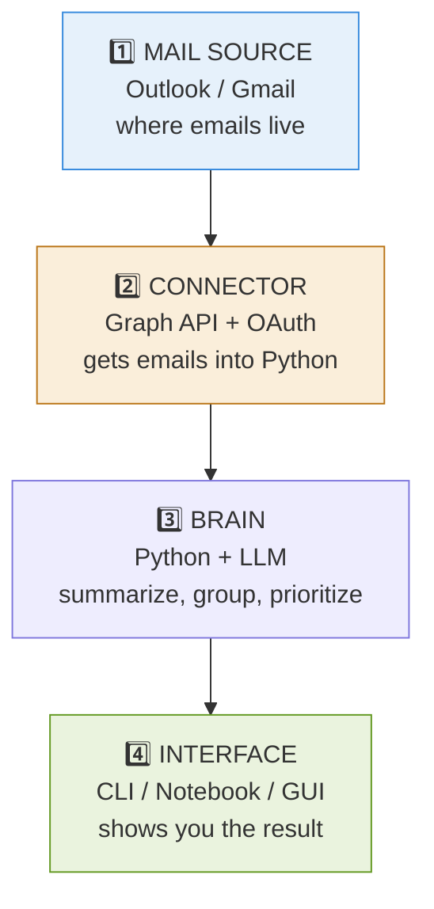
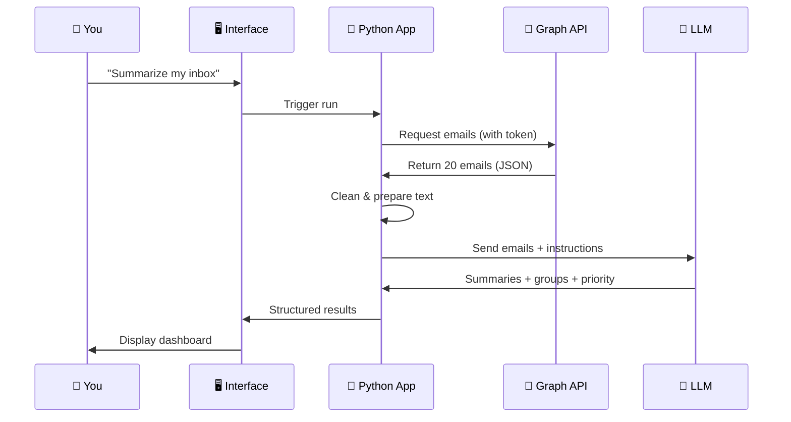
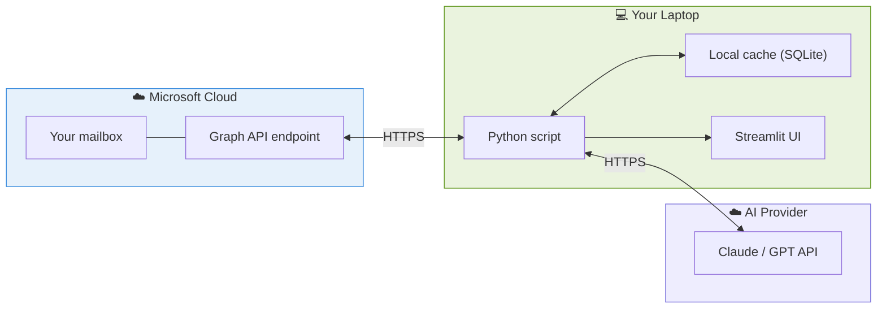

# 1 · Architecture 🏗️

> **The question this answers:** What are the moving parts, and how do they talk to each other?

[🏠 Overview](../README.md) · [Next: Where to Run It →](02-where-to-run-it.md)

---

## 🧩 The Four Pieces

Every email assistant has exactly four parts. Understand these and the rest is detail.



---

## 🔄 The Full Data Flow



---

## 🗺️ Where Each Piece Physically Lives



**Key insight:** Your Python app runs **locally on your machine**. It reaches *out* to two clouds (mail + AI). Nothing needs to be hosted anywhere to start.

---

## 📦 Suggested Project Layout

```
email-assistant/
├── src/
│   ├── connector.py      # Talks to Graph API
│   ├── summarizer.py     # LLM calls for summaries
│   ├── grouper.py        # Clustering logic
│   ├── prioritizer.py    # P1/P2/P3 rules
│   ├── replier.py        # Draft reply generation
│   └── app.py            # Streamlit UI
├── config/
│   └── settings.py       # API keys, thresholds
├── data/
│   └── cache.db          # Local SQLite
└── notebooks/
    └── explore.ipynb     # For experimenting
```

---

## ✅ Takeaways

- Four parts: **Source → Connector → Brain → Interface**
- Python runs **locally**, reaching out to mail cloud + AI cloud
- Keep each part in **its own module** so you can evolve them independently
- Nothing needs hosting until you want it always-on

---

[🏠 Overview](../README.md) · [Next: Where to Run It →](02-where-to-run-it.md)
