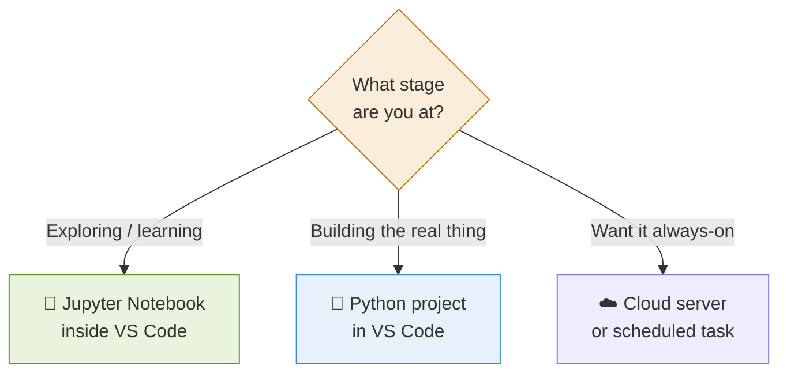
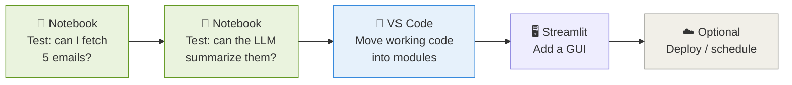
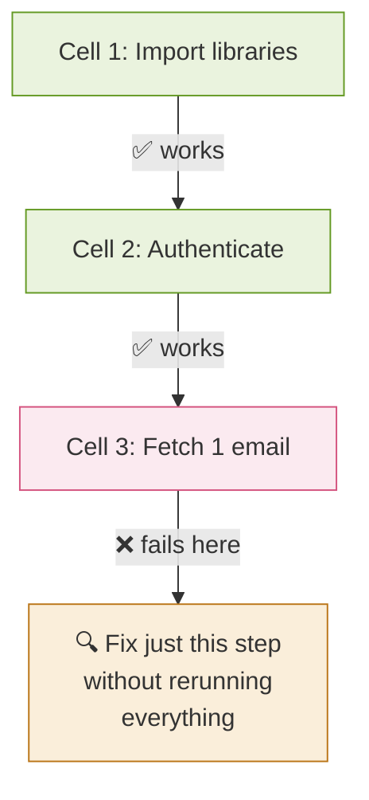
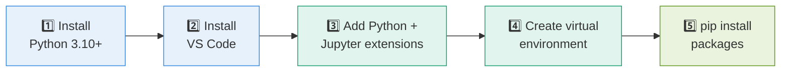

# 2 · Where to Run It 🖥️

> **The question this answers:** Jupyter notebook? VS Code? A server somewhere? — This is the clarity you need before writing any code.

[← Architecture](01-architecture.md) · [🏠 Overview](../README.md) · [Next: Connecting to Outlook →](03-connecting-to-outlook.md)

---

## 🤔 The Short Answer

**Recommendation:** Start in a **Jupyter notebook inside VS Code**, then graduate to **`.py` files in VS Code** once it works.

---

## 📊 The Three Options Compared

| | 📓 Jupyter Notebook | 📁 VS Code Project | ☁️ Cloud Server |
|---|---|---|---|
| **Best for** | Experimenting, learning | Real application | Always-on automation |
| **See results instantly** | ✅ Yes, cell by cell | ⚠️ Run whole script | ❌ Via logs |
| **Good for a GUI** | ❌ No | ✅ Yes | ✅ Yes |
| **Setup effort** | 🟢 Minimal | 🟡 Moderate | 🔴 High |
| **Runs when laptop off** | ❌ No | ❌ No | ✅ Yes |
| **Start here?** | ✅ **Yes** | Phase 2 | Phase 5+ |

---

## 🧭 The Recommended Progression

---

## 💡 Why Notebook First?

Connecting to Outlook has **many small steps that can each fail** (app registration, permissions, token, API call). A notebook lets you test **one step at a time** and see exactly where it breaks.

---

## ⚙️ Environment Setup (One Time)

**Packages you'll need:**

| Package | Purpose |
|---------|---------|
| `msal` | Microsoft authentication |
| `requests` | Calling the Graph API |
| `anthropic` or `openai` | LLM calls |
| `pandas` | Organizing email data |
| `streamlit` | The GUI (later) |

---

## ✅ Takeaways

- **Start in a Jupyter notebook** inside VS Code — test step by step
- **Move to `.py` modules** once each piece works
- **Cloud/server only later**, when you want it running unattended
- Your laptop is enough for everything through Phase 4

---

[← Architecture](01-architecture.md) · [🏠 Overview](../README.md) · [Next: Connecting to Outlook →](03-connecting-to-outlook.md)
