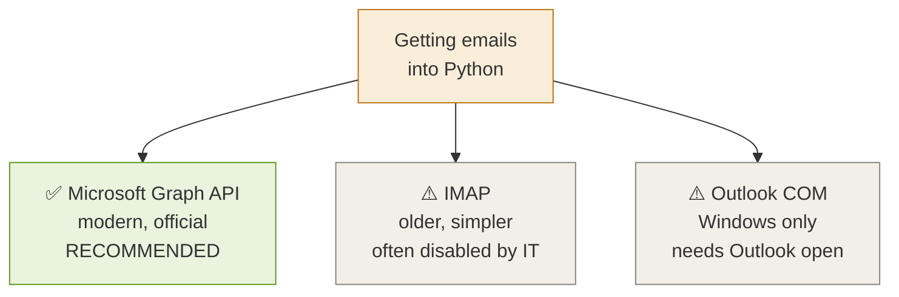
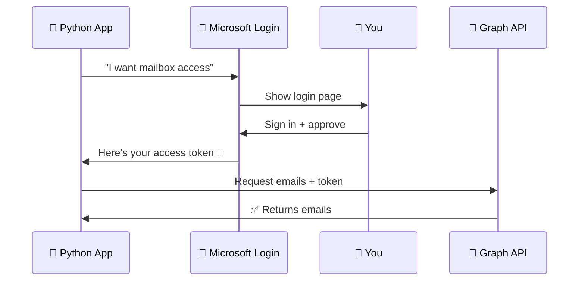
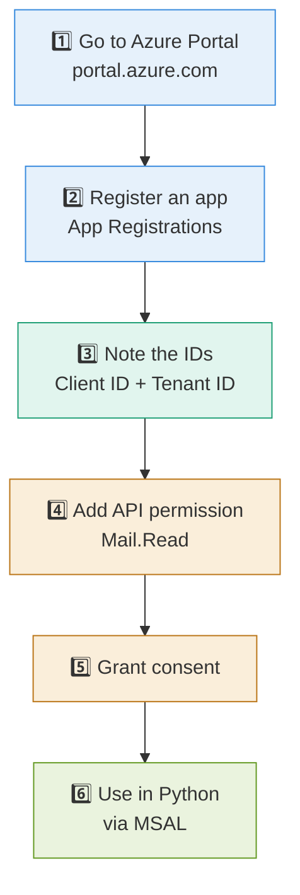
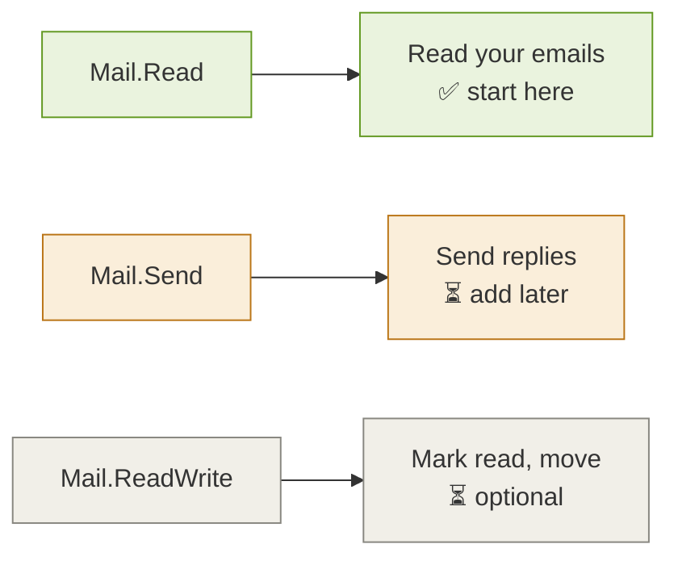
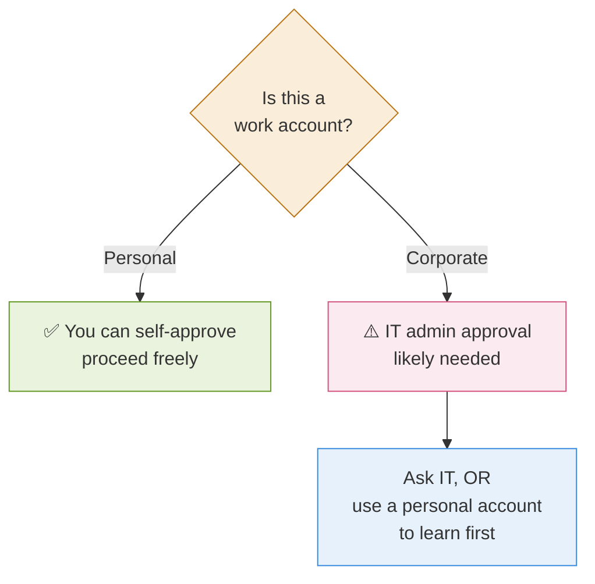

# 3 · Connecting to Outlook 🔌

> **The question this answers:** How does Python actually get my emails out of Outlook?

[← Where to Run It](02-where-to-run-it.md) · [🏠 Overview](../README.md) · [Next: Fetch & Summarize →](04-fetch-and-summarize.md)

---

## 🚪 The Three Ways In

**Use Graph API.** It's Microsoft's official modern route, works from any OS, and doesn't need Outlook installed.

---

## 🔐 How Authentication Works (OAuth 2.0)

You never put your password in code. Instead you get a **token** — a temporary pass.

---

## 🪪 The Setup Steps (One Time)

---

## 🔑 Permissions You'll Need

**Start with `Mail.Read` only.** Add send permission only when you're ready for the assistant to actually send.

---

## ⚠️ The Corporate Account Reality Check

**Important:** Many companies block app registrations on work accounts. If yours does, build and learn on a **personal Outlook/Gmail account** first.

---

## 📥 What You Get Back

The API returns emails as **JSON** — structured data Python can read directly:

| Field | What it holds |
|-------|--------------|
| `subject` | Email subject line |
| `from` | Sender name + address |
| `receivedDateTime` | When it arrived |
| `bodyPreview` | First ~255 chars |
| `body` | Full content |
| `importance` | Sender-set flag |
| `hasAttachments` | True/false |

These fields become your **raw material** for summarizing and prioritizing.

---

## ✅ Takeaways

- Use **Microsoft Graph API** — official and modern
- Auth via **OAuth 2.0 + MSAL**, never store passwords
- One-time setup: **register app → permissions → consent**
- Start with **`Mail.Read`** only
- On a **corporate account, expect an IT approval step**

---

[← Where to Run It](02-where-to-run-it.md) · [🏠 Overview](../README.md) · [Next: Fetch & Summarize →](04-fetch-and-summarize.md)
