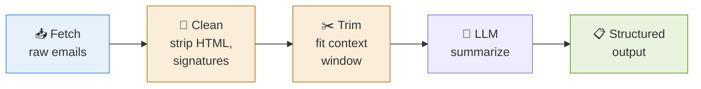
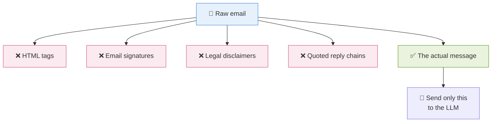
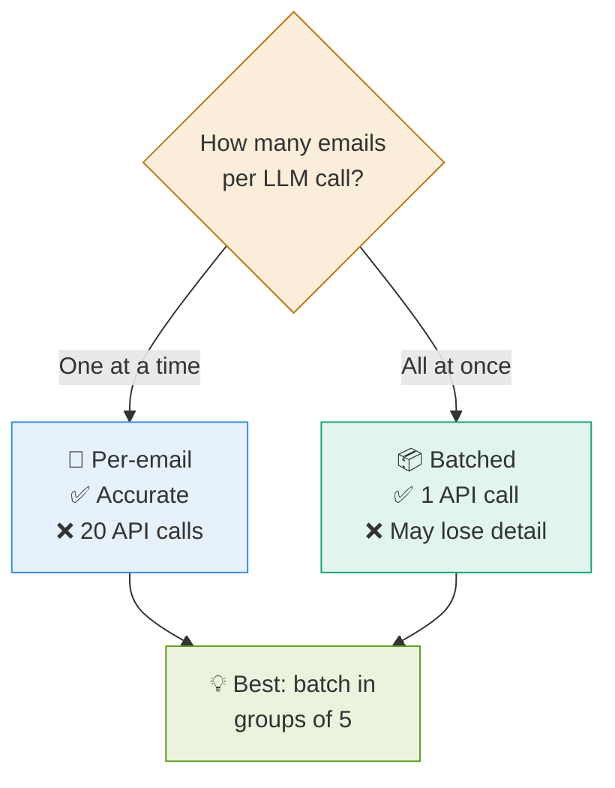
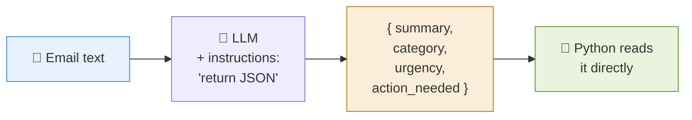
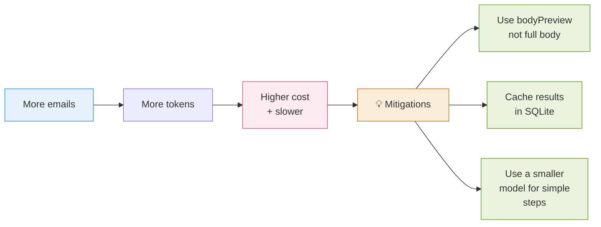

# 4 · Fetch & Summarize 📝

> **The question this answers:** Once I have the emails, how do I turn 20 messages into useful summaries?

[← Connecting to Outlook](03-connecting-to-outlook.md) · [🏠 Overview](../README.md) · [Next: Grouping →](05-grouping.md)

---

## 🔄 The Pipeline

---

## 🧹 Why Cleaning Matters

Raw emails are messy. Sending them straight to an LLM wastes context and confuses it.

---

## 🎯 Two Ways to Summarize

---

## 📋 Ask for Structured Output

Don't ask the LLM for prose — ask for **JSON**. Then Python can use it directly.

### The fields worth extracting

| Field | Why you need it |
|-------|----------------|
| `summary` | One-line gist |
| `sender_type` | Internal / client / vendor / automated |
| `topic` | For grouping later |
| `action_needed` | Does it need a reply? |
| `deadline_mentioned` | Feeds priority |
| `sentiment` | Detect frustration/escalation |

**These fields become the input for grouping and prioritization** — that's why you extract them now.

---

## 💰 Cost & Speed Awareness

---

## ✅ Takeaways

- **Clean before you send** — strip HTML, signatures, quoted chains
- **Batch in small groups** (~5 emails) to balance cost and accuracy
- **Always request JSON**, never prose — Python needs structure
- Extract the fields that **feed grouping and priority** later
- **Cache** so you never re-summarize the same email twice

---

[← Connecting to Outlook](03-connecting-to-outlook.md) · [🏠 Overview](../README.md) · [Next: Grouping →](05-grouping.md)
