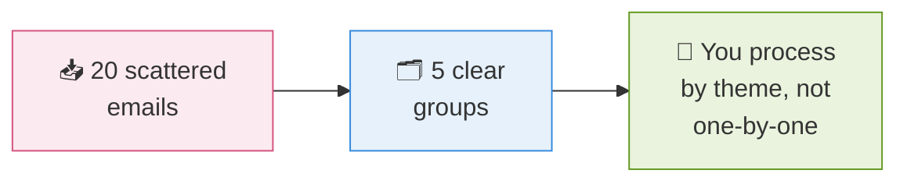
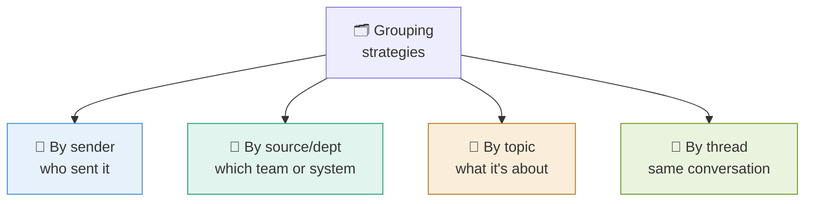
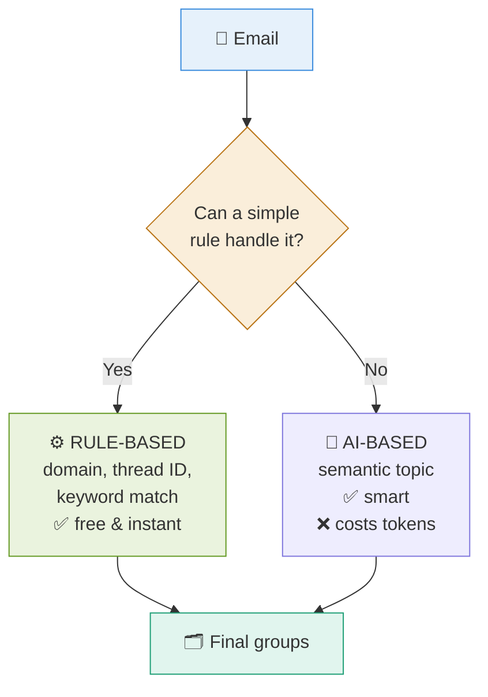
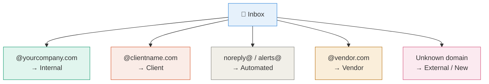
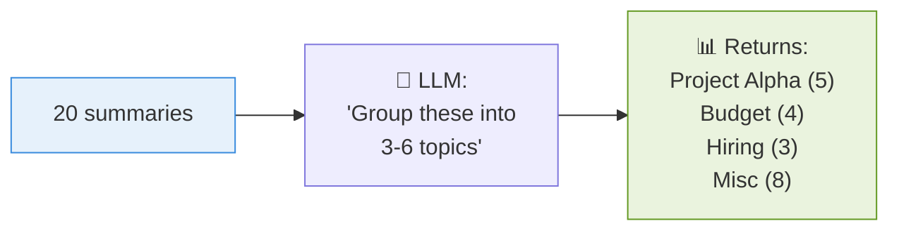
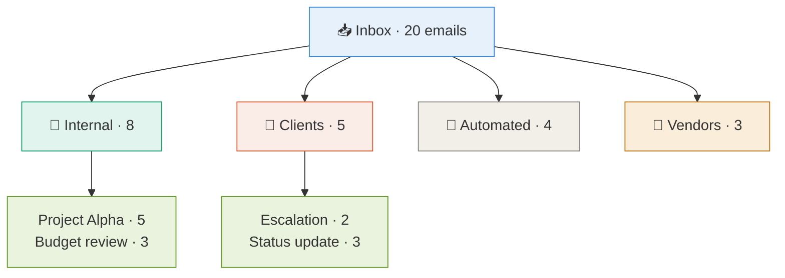

# 5 · Grouping Emails 🗂️

> **The question this answers:** How do 20 scattered emails get organized into meaningful groups?

[← Fetch & Summarize](04-fetch-and-summarize.md) · [🏠 Overview](../README.md) · [Next: Prioritization →](06-prioritization.md)

---

## 🎯 The Goal

---

## 🔀 Four Ways to Group

---

## ⚖️ Rules vs AI — Use Both

**Golden rule:** Do the cheap deterministic grouping first (sender domain, thread ID), then use the LLM only for what rules can't do (semantic topics).

---

## 🏢 Grouping by Source — The Practical One

This is **pure Python, no AI needed** — just parse the sender domain. Fast, free, reliable.

---

## 🧠 Topic Grouping with AI

For "what is this actually about," you need the LLM.

**Tip:** Feed it the **summaries**, not the full emails. Cheaper and the topics come out cleaner.

---

## 🎨 What the Output Looks Like

**Two levels:** source group first, topic sub-group inside. This is what makes 20 emails feel manageable.

---

## ✅ Takeaways

- Group by **sender, source, topic, or thread** — often several at once
- **Rules first** (free, instant), **AI second** (for meaning)
- Sender-domain grouping is pure Python — start there
- Feed **summaries** to the LLM for topic grouping, not full text
- Two-level output (source → topic) is the most useful shape

---

[← Fetch & Summarize](04-fetch-and-summarize.md) · [🏠 Overview](../README.md) · [Next: Prioritization →](06-prioritization.md)
