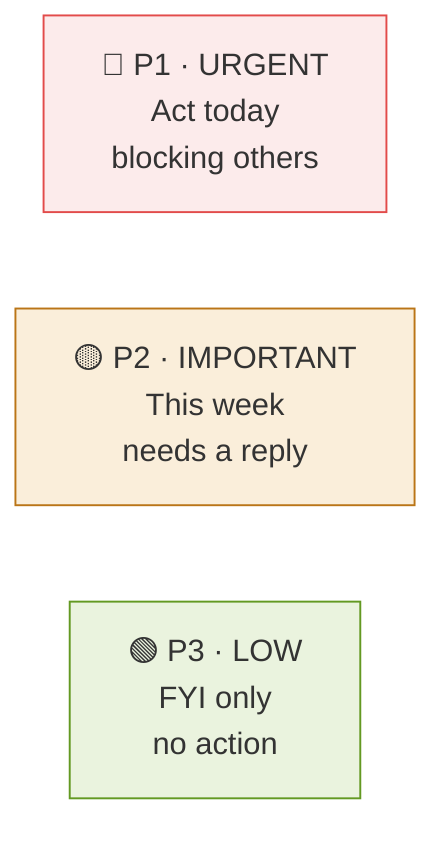
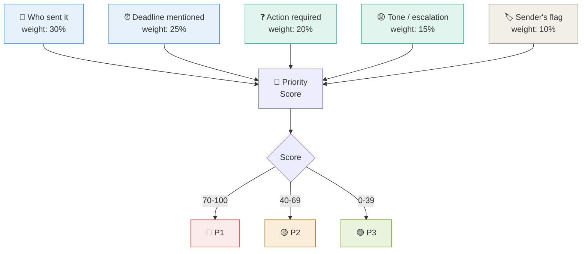
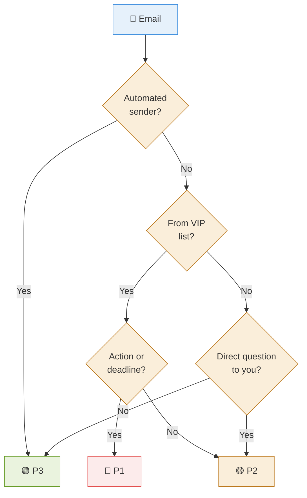
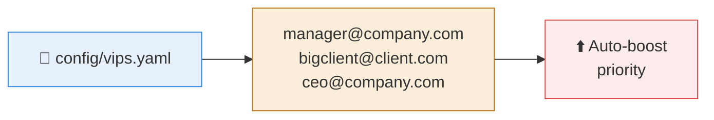
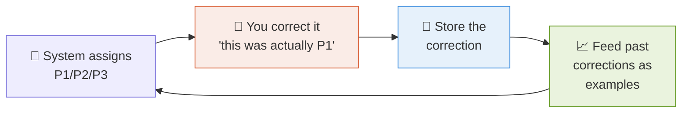
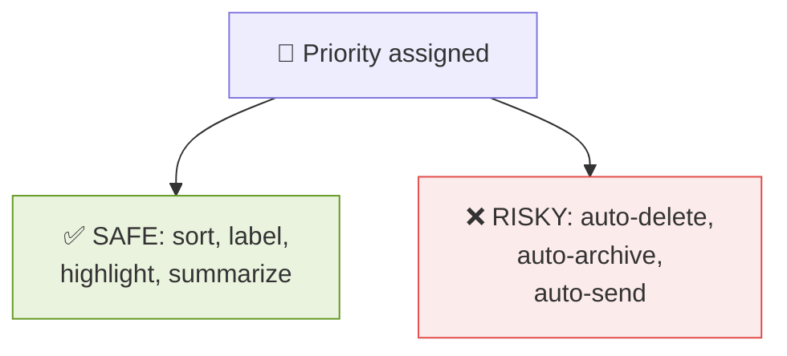

# 6 · Prioritization 🚦

> **The question this answers:** How does the system decide what's P1 vs P2 vs P3 — and how do I make that trustworthy?

[← Grouping](05-grouping.md) · [🏠 Overview](../README.md) · [Next: Reply Suggestions →](07-reply-suggestions.md)

---

## 🚦 The Three Levels

---

## ⚖️ The Scoring Model

Priority isn't one thing — it's **several signals combined into a score**.

---

## 🎛️ The Signals Explained

| Signal | What raises priority | Rule or AI? |
|--------|---------------------|:-----------:|
| 👤 **Sender importance** | Your manager, key client, exec | ⚙️ Rule (VIP list) |
| ⏰ **Deadline language** | "by EOD", "urgent", "today" | 🧠 AI |
| ❓ **Action required** | A direct question to you | 🧠 AI |
| 😟 **Escalation tone** | Frustration, repeated follow-up | 🧠 AI |
| 🏷️ **Importance flag** | Sender marked it high | ⚙️ Rule |
| 👥 **To vs CC** | You're in "To" not "CC" | ⚙️ Rule |
| 🤖 **Automated sender** | noreply@ → lowers priority | ⚙️ Rule |

---

## 🔀 The Decision Flow

---

## 👑 The VIP List — Your Most Powerful Lever

A simple config file you maintain by hand. **No AI needed, huge accuracy gain.** Build this early.

---

## 🔁 Making It Learn Over Time

**This is the killer feature.** Store your corrections, then include a few as examples in the prompt. The system gets personalized without any model training.

---

## ⚠️ Design Principle: Never Auto-Delete

The system will get priority wrong sometimes. **Keep it advisory, keep the human deciding.**

---

## ✅ Takeaways

- Priority = **weighted score** from several signals, not one rule
- Mix **rules** (VIP list, CC vs To, automated senders) with **AI** (deadlines, tone)
- Build the **VIP list early** — biggest accuracy win for least effort
- **Store your corrections** and feed them back as examples
- Keep it **advisory** — never auto-delete or auto-send

---

[← Grouping](05-grouping.md) · [🏠 Overview](../README.md) · [Next: Reply Suggestions →](07-reply-suggestions.md)
