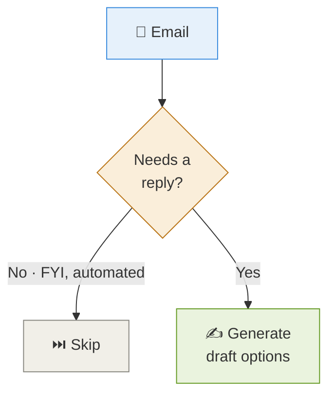
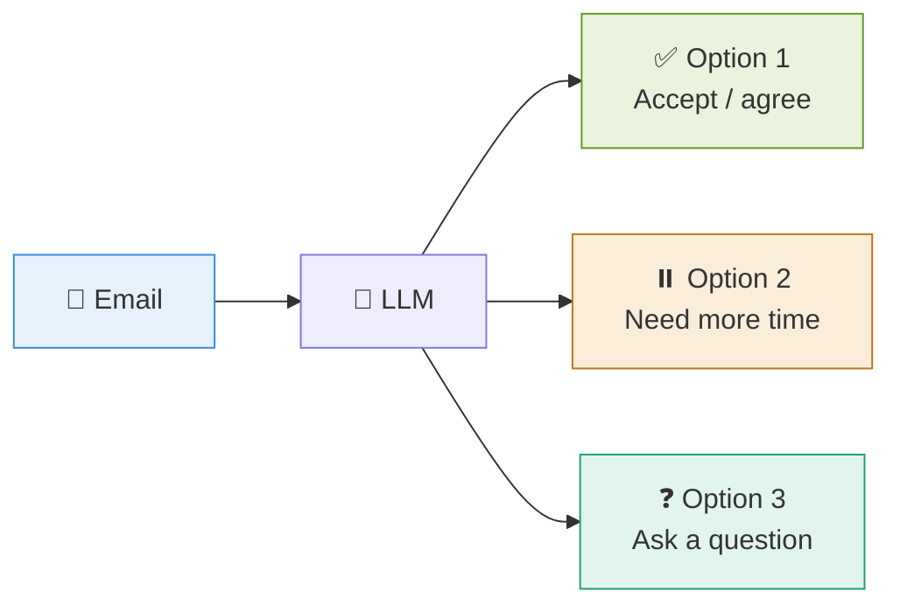
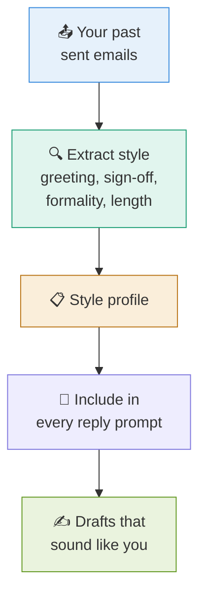
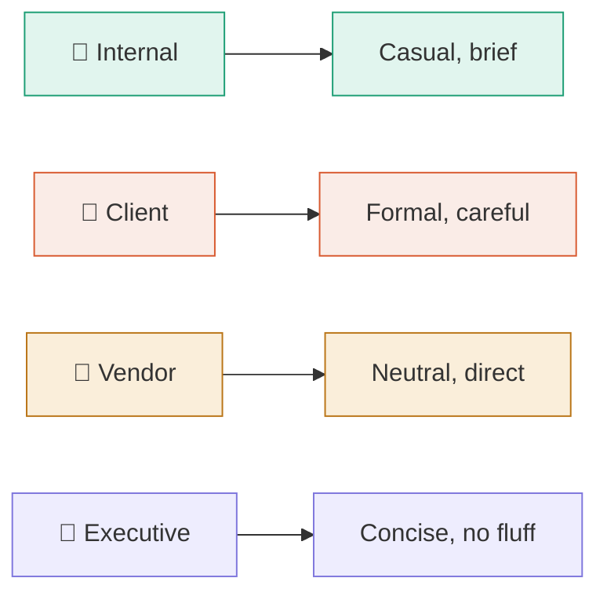
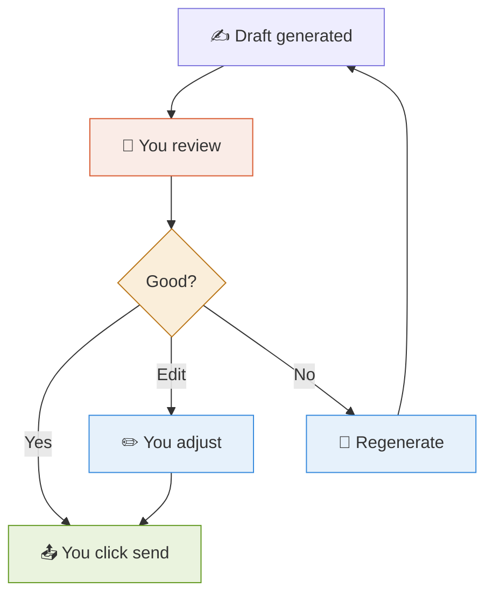

# 7 · Reply Suggestions ✍️

> **The question this answers:** How does the assistant draft replies that actually sound like me?

[← Prioritization](06-prioritization.md) · [🏠 Overview](../README.md) · [Next: Interface →](08-interface.md)

---

## 🎯 Not Every Email Needs a Reply

**First decision is binary.** Only generate replies where they're actually needed — saves tokens and noise.

---

## 🎭 Give Options, Not One Answer

Different **intents**, not just different tones. You pick the direction, then edit.

---

## 🗣️ Making It Sound Like You

**The trick:** pull ~10 of your sent emails, have the LLM describe your style once, save that description, and paste it into every reply prompt. Cheap and surprisingly effective.

---

## 🎚️ Tone Should Match the Group

Your grouping work from Doc 5 **feeds directly into this** — the group tells the LLM which tone to use.

---

## 🛡️ The Human-in-the-Loop Rule

**Never auto-send.** The assistant drafts; you approve. This is non-negotiable for anything touching real people.

---

## ⚠️ What to Watch For

| Risk | Mitigation |
|------|-----------|
| 🤥 **Invented facts** | Never let it state details not in the thread |
| 📅 **Fake commitments** | Don't let it promise dates you didn't approve |
| 🔒 **Leaking context** | Don't include unrelated emails in the prompt |
| 🎭 **Wrong tone** | Match tone to the sender group |

---

## ✅ Takeaways

- **Decide first** whether a reply is even needed
- Offer **2–3 options with different intents**, not one draft
- Build a **style profile** from your sent mail — sounds like you, cheaply
- **Tone follows the group** from your grouping logic
- **Always human-in-the-loop.** Draft, never auto-send

---

[← Prioritization](06-prioritization.md) · [🏠 Overview](../README.md) · [Next: Interface →](08-interface.md)
