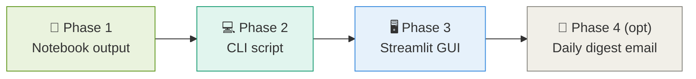
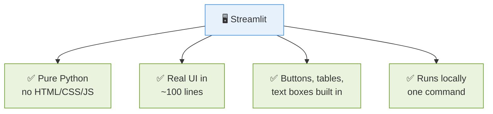
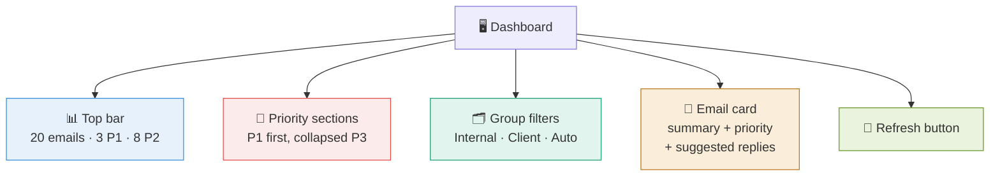
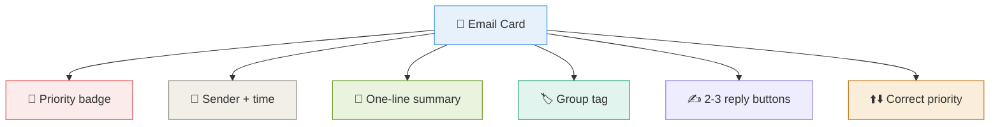
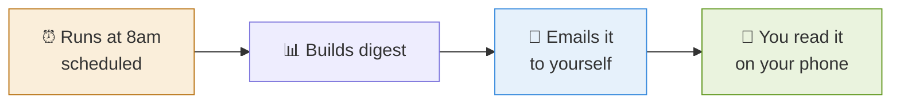

# 8 · Interface Options 🖥️

> **The question this answers:** Will this be a GUI? A notebook? Something else? — and what should I build first?

[← Reply Suggestions](07-reply-suggestions.md) · [🏠 Overview](../README.md) · [Next: Knowledge Required →](09-knowledge-required.md)

---

## 🎯 The Recommendation

**Answer: yes, eventually a GUI — use Streamlit.** But don't start there.

---

## ⚖️ The Options Compared

| | 📓 Notebook | 💻 CLI | 🖥️ Streamlit | 🌐 Web App |
|---|---|---|---|---|
| **Effort** | 🟢 None | 🟢 Low | 🟡 Medium | 🔴 High |
| **Looks good** | ❌ | ❌ | ✅ | ✅✅ |
| **Interactive** | ⚠️ Limited | ❌ | ✅ | ✅ |
| **Shareable** | ❌ | ❌ | ⚠️ Local | ✅ |
| **Build in** | Phase 1 | Phase 2 | **Phase 3** | Later |

---

## 🌟 Why Streamlit

For a Python developer who doesn't want to learn web development, **Streamlit is the shortest path to a real interface.**

---

## 🎨 What the GUI Should Show

---

## 📧 The Email Card — Your Core UI Unit

Note the **correct-priority buttons** — that's what feeds the learning loop from Doc 6.

---

## 💡 The Alternative: No GUI at All

**Underrated option.** A daily digest email needs no UI at all and you read it wherever you already are. Consider this before building a GUI.

---

## ✅ Takeaways

- **Notebook → CLI → Streamlit** is the right progression
- **Streamlit** = real GUI without learning web dev
- The **email card** is your core UI unit — summary, priority, replies, correction
- Include **priority-correction buttons** to power the learning loop
- A **daily digest email** may be all you actually need

---

[← Reply Suggestions](07-reply-suggestions.md) · [🏠 Overview](../README.md) · [Next: Knowledge Required →](09-knowledge-required.md)
