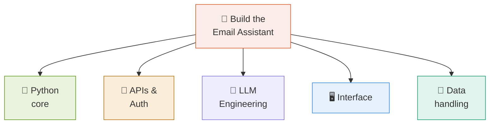
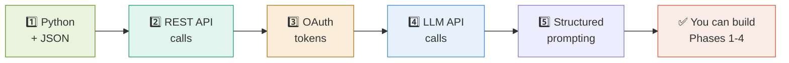
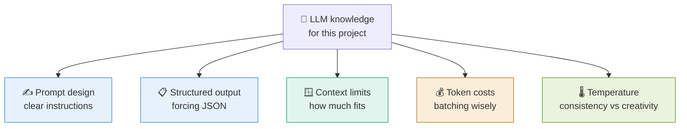
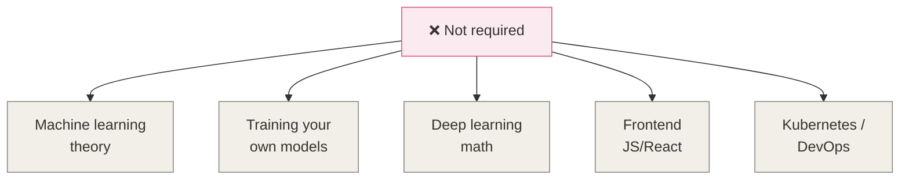

# 9 · Knowledge Required 🎓

> **The question this answers:** What do I actually need to know to build this — and what can I learn along the way?

[← Interface](08-interface.md) · [🏠 Overview](../README.md) · [Next: Build Roadmap →](10-build-roadmap.md)

---

## 🗺️ The Skill Map

---

## 📋 Skills Breakdown by Difficulty

| Skill | What for | Difficulty | Must-have? |
|-------|---------|:----------:|:----------:|
| 🐍 **Python basics** | Everything | 🟢 Easy | ✅ Required |
| 📦 **Dicts & JSON** | Handling email data | 🟢 Easy | ✅ Required |
| 🌐 **REST APIs** | Calling Graph API | 🟡 Medium | ✅ Required |
| 🔐 **OAuth 2.0** | Authentication | 🟡 Medium | ✅ Required |
| 🧠 **Prompt engineering** | Summaries, grouping | 🟡 Medium | ✅ Required |
| 📋 **Structured output** | Getting JSON from LLM | 🟡 Medium | ✅ Required |
| 🐼 **Pandas** | Organizing results | 🟢 Easy | ⭐ Helpful |
| 💾 **SQLite** | Caching | 🟢 Easy | ⭐ Helpful |
| 🖥️ **Streamlit** | The GUI | 🟡 Medium | ⏳ Phase 3 |
| 🔍 **Embeddings** | Smarter grouping | 🔴 Hard | ⏳ Optional |
| 🎯 **Agents** | Full autonomy | 🔴 Hard | ⏳ Later |

---

## 🎯 The Critical Path — Learn These First

**Five skills gets you a working assistant.** Everything else is enhancement.

---

## 🧠 The LLM Concepts That Matter Here

**Temperature tip:** use **low temperature** for summarizing and prioritizing (you want consistency), **higher** for reply drafts (you want variety in the options).

---

## 🚫 What You Do NOT Need

**This is an API-orchestration project, not a machine-learning project.** You're wiring together existing services — no model training involved.

---

## 📚 Learning Order Suggestion

| Week | Focus | Outcome |
|:----:|-------|---------|
| 1 | REST APIs + JSON in Python | Can call any API |
| 2 | OAuth + Graph API | Can fetch your emails |
| 3 | LLM API + prompting | Can summarize text |
| 4 | Structured output (JSON mode) | Can get usable data back |
| 5 | Put it together | Working Phase 1–2 |
| 6+ | Streamlit | Working GUI |

---

## ✅ Takeaways

- **Five core skills**: Python/JSON, REST APIs, OAuth, LLM calls, structured prompting
- **No ML theory needed** — this is orchestration, not model building
- **OAuth is the hardest early hurdle** — budget time for it
- **Low temperature** for analysis, **higher** for reply variety
- Embeddings and agents are **optional upgrades**, not requirements

---

[← Interface](08-interface.md) · [🏠 Overview](../README.md) · [Next: Build Roadmap →](10-build-roadmap.md)
