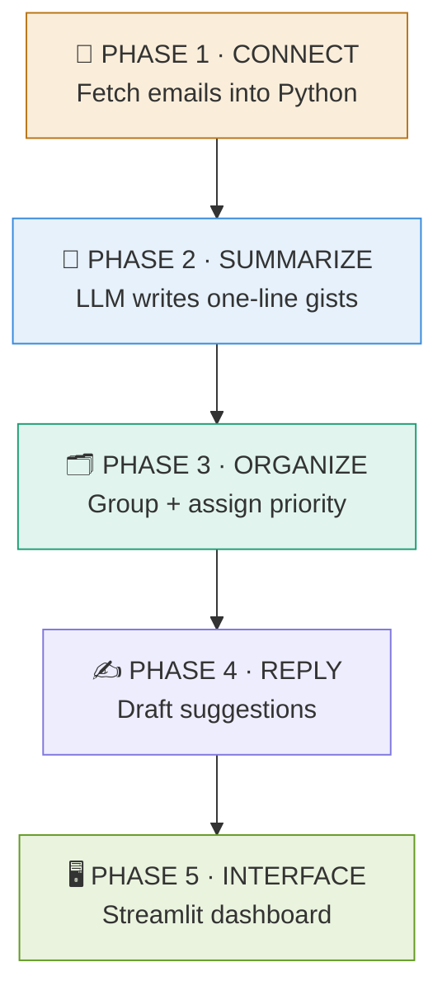
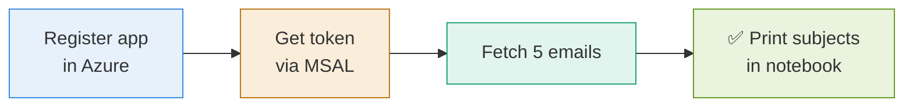
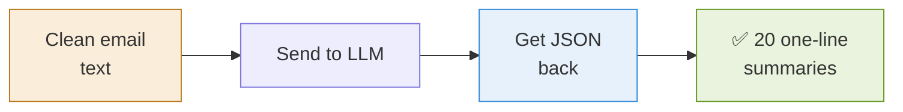
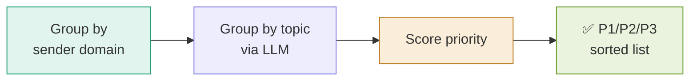
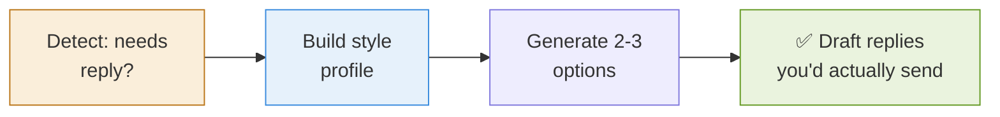
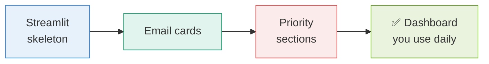
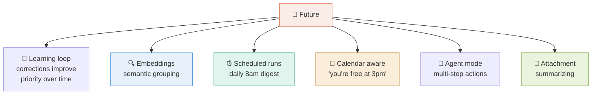
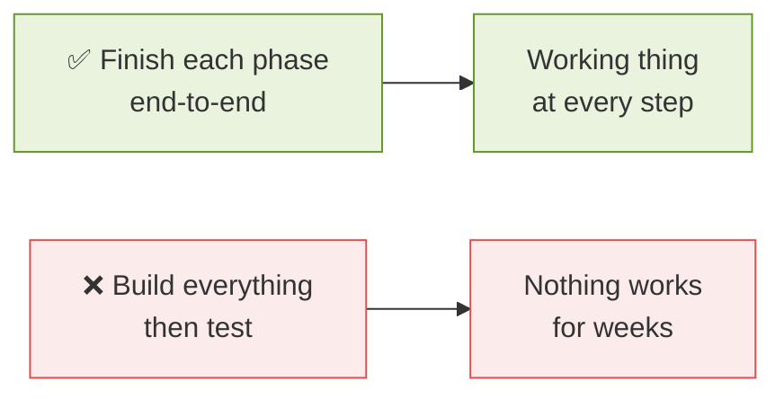

# 10 · Build Roadmap 🗺️

> **The question this answers:** In what order do I actually build this, and what does "done" look like at each stage?

[← Knowledge Required](09-knowledge-required.md) · [🏠 Overview](../README.md)

---

## 🚀 The Five Phases

---

## 📡 Phase 1 · Connect

**Done when:** you can print 5 email subjects from your real inbox in a notebook.
**Hardest part:** OAuth setup. Expect this to take the longest.

---

## 📝 Phase 2 · Summarize

**Done when:** you get a clean list of 20 summaries as structured JSON.

---

## 🗂️ Phase 3 · Organize

**Done when:** your inbox comes back sorted into groups with priorities attached.
**Build the VIP list here** — biggest accuracy gain.

---

## ✍️ Phase 4 · Reply

**Done when:** drafts sound like you and need only light editing.

---

## 🖥️ Phase 5 · Interface

**Done when:** you open it each morning instead of your inbox.

---

## 🔮 Future Ideas (Beyond Phase 5)

---

## ⏱️ Realistic Timeline

| Phase | Effort | Calendar time (part-time) |
|:-----:|--------|---------------------------|
| 1 · Connect | 🔴 Hardest | 1–2 weeks |
| 2 · Summarize | 🟢 Easy | 2–3 days |
| 3 · Organize | 🟡 Medium | 1 week |
| 4 · Reply | 🟡 Medium | 1 week |
| 5 · Interface | 🟡 Medium | 1 week |

**Total: roughly 4–6 weeks part-time** to a working daily-use tool.

---

## 🎯 The One Rule

**Ship each phase before starting the next.** A working Phase 2 beats a half-built Phase 5.

---

## ✅ Takeaways

- Five phases: **Connect → Summarize → Organize → Reply → Interface**
- **Phase 1 is the hardest** — OAuth eats the most time
- **4–6 weeks part-time** to daily-use quality
- **Finish each phase end-to-end** before moving on
- Everything after Phase 5 is optional evolution

---

[← Knowledge Required](09-knowledge-required.md) · [🏠 Overview](../README.md)
