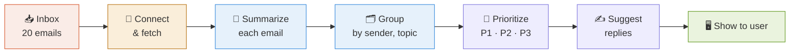
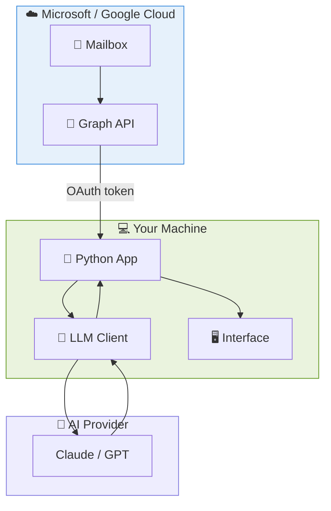
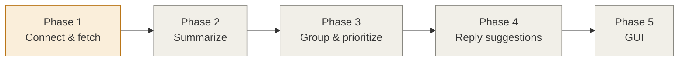

# 📬 AI Email Assistant

> A Python-based assistant that connects to your **Outlook / Gmail** inbox, **summarizes** your emails, **groups** them, assigns **priority**, and **suggests replies** — all powered by an LLM.

---

## 🎯 What It Does

---

## 📚 Documentation Map

| # | Doc | What it covers |
|:-:|-----|----------------|
| 1 | [Architecture](01-architecture.md) | The big picture — where everything runs |
| 2 | [Where to Run It](docs/02-where-to-run-it.md) | Jupyter vs VS Code vs server — decided |
| 3 | [Connecting to Outlook](docs/03-connecting-to-outlook.md) | Auth, Graph API, getting emails into Python |
| 4 | [Fetch & Summarize](docs/04-fetch-and-summarize.md) | Reading the inbox, building summaries |
| 5 | [Grouping Emails](docs/05-grouping.md) | How emails get clustered |
| 6 | [Prioritization](docs/06-prioritization.md) | How P1/P2/P3 gets assigned |
| 7 | [Reply Suggestions](docs/07-reply-suggestions.md) | Generating draft replies |
| 8 | [Interface Options](docs/08-interface.md) | CLI, notebook, or GUI? |
| 9 | [Knowledge Required](docs/09-knowledge-required.md) | Skills roadmap to build this |
| 10 | [Build Roadmap](docs/10-build-roadmap.md) | Phase-by-phase plan |

---

## 🏗️ System at a Glance

---

## 🧰 Tech Stack (High Level)

| Layer | Choice | Why |
|-------|--------|-----|
| 🐍 Language | Python 3.10+ | Best AI/LLM ecosystem |
| 📧 Mail access | Microsoft Graph API | Official, modern, works with Outlook 365 |
| 🔐 Auth | OAuth 2.0 (MSAL library) | Secure, no password storage |
| 🧠 AI | Claude / OpenAI API | Summaries, grouping, replies |
| 🖥️ Interface | Streamlit (recommended) | Fastest path to a real GUI |
| 💾 Storage | SQLite | Simple local cache |

---

## 🚦 Project Status

*Start here → [Architecture](docs/01-architecture.md)*
